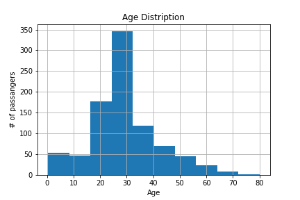
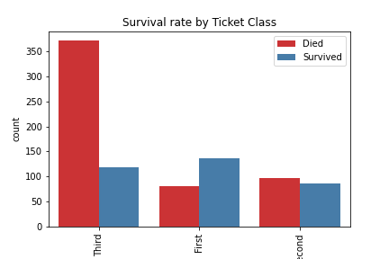
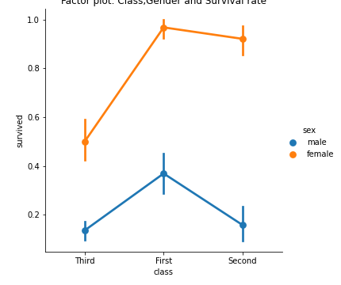

## Abstract 
The sinking of the Titanic is one of the most
 infamous shipwrecks in history.

On April 15, 1912, during her maiden voyage, 
the widely considered “unsinkable” RMS Titanic
sank after colliding with an iceberg. 
Unfortunately, there weren’t enough 
lifeboats for everyone onboard, resulting
in the death of 1502 out of 2224 passengers
and crew.

While there was some element of luck involved
 in surviving, it seems some groups of people 
 were more likely to survive than others. 
 This implies that predictive modelling can
 be done to determine chances of survival
 and what factors affected the chances of 
 survival.
 
 This project entails predicting whether a
 given passenger survived or succumbed. 
 The model is purely build on Tensorflow.
 
 Results: After training, the linear classifier
 achieved 82% accuracy on training data and 78%
 for test set.
 
 ## Data
 891 entries in total - 700 for training and 
 191 for testing.
 
 ## Root Dir - Files and Folders
 
 - `model.ipynb` - A notebook file in which
 Tensorflow model is build.
 
 - `visualization.ipynb` - Data visualization
 is done here.
 
 - `data` - is a folder that holds the data
 used to train and test the model.
 
 - `output` - plots generated in data visualization
 and the model outputs are stored here.
 
 - `data_description.txt` - holds the information
 about the features in the dataset.
 
 ## Plots
 (explanations are on the `visualization.ipynb`)
 <table style="width:100%">
  <tr>
    <th></th>
    <th></th>
  </tr>
  </table>
  
  <table style="width:100%">
  <tr>
    <th></th>
    <th></th>
  </tr>
  </table>
  
  <table style="width:100%">
  <tr>
    <th></th>
  </tr>
  </table>

